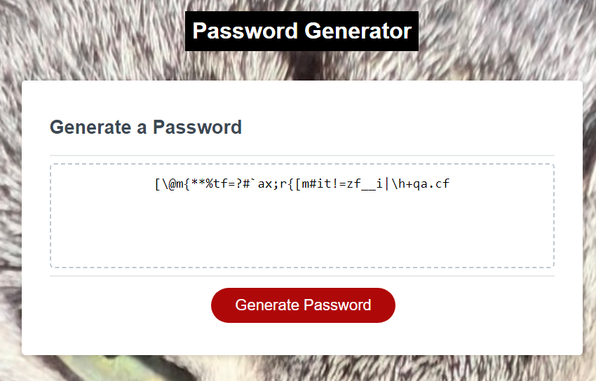

# Password Generator
## Description

A small webpage that will generate a unique password using the answers the user gave.

## Installation

Nothing special is needed to install. It's just an HTML, CSS, JS, and some picture assets.

## Usage

You can view the published webpage [here](https://spawze.github.io/Password-Generator-With-A-Very-Uniquely-Named-Repository/)  

Press the red 'Generate Password' button to start generating a password. It will ask you how many characters you want (must be between 8 and 128 characters) and if you want the password to have lowercase, uppercase, numbers, and special characters. After all things are answered, the password will generate and display on the webpage.

## Credits

Made by Riley A.

## License

MIT License

Please See License file in the repository.
